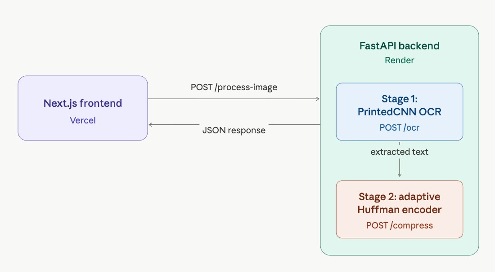
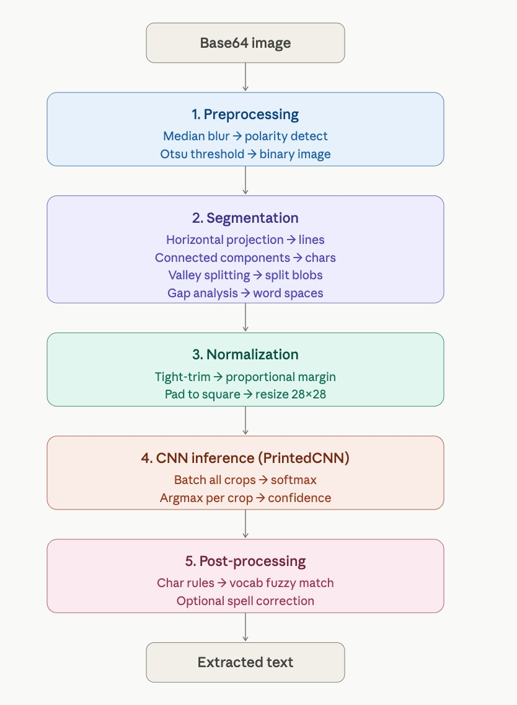

# Strike3 - 2-Stage Neural Compression Pipeline

A full-stack, end-to-end pipeline that ingests a noisy scanned document image, extracts its text with a custom-trained PrintedCNN model, and compresses the output with a from-scratch Adaptive Huffman encoder - all exposed as two communicating FastAPI microservices and visualized in a Next.js dashboard.

---

## Table of Contents

1. [Architecture Overview](#architecture-overview)
2. [Stage 1 - OCR Microservice (PrintedCNN)](#stage-1---ocr-microservice-printedcnn)
3. [Stage 2 - Compression Microservice (Adaptive Huffman)](#stage-2---compression-microservice-adaptive-huffman)
4. [API Reference](#api-reference)
5. [Frontend](#frontend)
6. [Setup & Running Locally](#setup--running-locally)
7. [Training Stage 1 OCR](#training-stage-1-ocr)
8. [Deployment](#deployment)
9. [Benchmarks & Metrics](#benchmarks--metrics)

---

## Architecture Overview



The `/process-image` endpoint orchestrates both stages in a single call: it runs OCR on the uploaded image, pipes the extracted text into the Adaptive Huffman encoder, decompresses, and verifies lossless recovery - returning all metrics in one JSON response.

### How the Microservices Communicate

The system is organized as two logical microservices inside the FastAPI backend:
- **Stage 1 /ocr** performs OCR on the uploaded image and returns extracted text.
- **Stage 2 /compress, /decompress, and /verify** consume text produced by Stage 1 and return compression metrics, tree snapshots, and lossless verification results.

For the end-to-end user flow, the frontend sends a single `multipart/form-data` request to `/process-image`. That endpoint first runs OCR, then passes the resulting text into the Adaptive Huffman service in-process using structured request/response payloads (`CompressRequest`, `DecompressRequest`, `VerifyRequest`), and finally returns one combined JSON response to the frontend.

---

## Stage 1 - OCR Microservice (PrintedCNN)

Stage 1 is a FastAPI OCR service that processes noisy document images through a full vision pipeline:

1. Preprocess image (automatic polarity + Otsu binarization)
2. Segment lines and character blobs (projection + connected components)
3. Split suspiciously wide blobs using vertical valley detection
4. Normalize crops to 28x28 and batch classify with a CNN
5. Apply post-processing (char-level rules + domain-vocab fuzzy correction)

### Stage 1 Architecture Diagram

<p align="center">
  
</p>

### Model

Deployed model: **PrintedCNN** (single checkpoint: `printed_cnn.pth`), 47 classes:
- Digits `0-9`
- Uppercase `A-Z`
- Lowercase subset: `a, b, d, e, f, g, h, n, q, r, t`

Architecture summary:
- 4 convolution blocks with BatchNorm + ReLU
- MaxPooling in first 3 blocks (`28->14->7->3`)
- Fully-connected head: `256x3x3 -> 512 -> 47` with dropout 0.2

### CNN Architecture Justification

- **4 convolution blocks** were enough to capture stroke edges, loops, and printed character structure without making the model too heavy for CPU deployment.
- **3x3 kernels** preserve local spatial detail, which matters for visually similar classes such as `0/O`, `1/I`, and `5/S`.
- **BatchNorm + ReLU** stabilized training and improved convergence on mixed synthetic/noisy data.
- **Three max-pooling stages** reduce the 28x28 crop to a compact 3x3 feature map, keeping the classifier lightweight while still preserving enough shape information.
- **A 512-unit fully connected layer with dropout 0.2** gave a good balance between capacity and overfitting control for 47 output classes.
- The final design was chosen for **fast inference on small normalized crops**, which matters more here than a deeper network because segmentation quality dominates end-to-end OCR accuracy.

### Training Data Strategy

The Stage 1 model was trained using a mixed dataset strategy to improve robustness on noisy scans:
- **EMNIST + MNIST** for core character priors
- **Fonts-based synthetic data** (printed character crops and lines) for document-style text
- **Pipeline-aligned synthetic crops** generated through the same preprocessing/segmentation flow used at inference

Noise augmentation included both **Gaussian** and **salt-and-pepper** perturbations to match evaluation conditions.

### Dataset Split and Training Details

The training pipeline in `ocr_service_final/finetune/train_printed_only.py` uses:
- **80/20 split in the Stage 1 design target**, with the current printed-CNN trainer using a **90/10 train/validation split** generated with a fixed random seed (`42`) for reproducibility.
- **Optimizer:** Adam, learning rate `0.001`
- **Scheduler:** ReduceLROnPlateau with patience `3` and factor `0.5`
- **Loss:** CrossEntropyLoss
- **Epochs:** up to `30`
- **Batch size:** `128`
- **Early stopping:** stop after `6` epochs without validation improvement

Training-time augmentation is applied per sample:
- **30% Gaussian noise**
- **20% salt-and-pepper noise**
- **50% clean samples**

The deployed checkpoint is the best validation model saved as `printed_cnn.pth`.

### Why this worked better

- Segmentation quality improved end-to-end OCR more than only increasing model depth
- Width-aware blob splitting reduced merged-character errors
- Post-processing recovered common OCR confusions without over-correcting
- A single lightweight checkpoint (`printed_cnn.pth`) made deployment simpler and faster

---

## Stage 2 - Compression Microservice (Adaptive Huffman)

### Algorithm

A **from-scratch FGK (Faller-Gallager-Knuth) Adaptive Huffman** encoder/decoder - no external compression libraries (`zlib`, `gzip`, etc.) are used anywhere.

The encoder maintains a live Sibling Property tree. As each character is encoded:
1. If the symbol is new, emit the NYT (Not Yet Transmitted) codeword + raw Unicode bits
2. If the symbol exists, emit its current Huffman codeword
3. Walk up the tree incrementing weights, swapping nodes to maintain the Sibling Property

The decoder mirrors this process, reconstructing the identical tree state symbol-by-symbol, achieving **lossless recovery** with no transmitted tree or codebook.

### Metrics Reported

| Metric | Formula |
|---|---|
| **Compression ratio** | `original_bytes / compressed_bytes` |
| **Entropy** | $H = -\sum p_i \log_2 p_i$ bits/symbol |
| **Encoding efficiency** | `(entropy x original_bytes) / (compressed_bits) x 100 %` |

---

## API Reference

All endpoints are served by the FastAPI backend (root dir: `backend/`).

### `GET /health`
Returns `{"status": "ok"}`. Used by Render for health checks.

### `POST /ocr`
Upload an image file, receive extracted text.

**Request:** `multipart/form-data`, field `file` (any common image format)

**Response:**
```json
{ "text": "extracted text here" }
```

### `POST /compress`
Compress a text string with Adaptive Huffman.

**Request:** `{"text": "..."}`

**Response:**
```json
{
  "compressed_data": "<bitstring>",
  "compression_ratio": 1.85,
  "entropy": 4.21,
  "encoding_efficiency": 94.3,
  "original_size": 1200,
  "compressed_size": 650,
  "latency": 12,
  "huffman_tree": {
    "root": "*",
    "structure": {"nodes": [], "edges": []}
  },
  "steps": []
}
```

### `POST /decompress`
Decompress a previously compressed bitstring.

**Request:** `{"compressed_data": "<bitstring>"}`

**Response:** `{"text": "original text"}`

### `POST /verify`
Round-trip check: compress -> decompress -> diff.

**Request:** `{"original_text": "...", "decompressed_text": "..."}`

**Response:** `{"is_lossless": true, "char_match": 120, "char_total": 120, "match_percentage": 100.0}`

### `POST /process-image`
**Full pipeline endpoint.** Accepts an image, runs OCR then compression+verification internally.

**Request:** `multipart/form-data`, field `file`

**Response:**
```json
{
  "ocr_text": "...",
  "compression": {
    "compressed_data": "...",
    "compression_ratio": 1.85,
    "entropy": 4.21,
    "encoding_efficiency": 94.3,
    "original_size": 1200,
    "compressed_size": 650,
    "latency": 12,
    "huffman_tree": {
      "root": "*",
      "structure": {"nodes": [], "edges": []}
    },
    "steps": []
  },
  "verification": {
    "is_lossless": true,
    "char_match": 120,
    "char_total": 120,
    "match_percentage": 100.0
  },
  "total_latency": 340
}
```

---

## Frontend

Built with **Next.js 16 + React 19 + Tailwind CSS**, deployed on Vercel.

Three animated pipeline stages visualised in real time:
- **OCR Stage** - file picker, live extracted text display
- **Compression Stage** - compression ratio, entropy, encoding efficiency cards
- **Verification Stage** - lossless match confirmation

Six live metric cards appear after pipeline completion:
- OCR Accuracy (Gaussian) - OCR Accuracy (Salt and Pepper) - Compression Ratio - Entropy - Encoding Efficiency - E2E Latency

---

## Setup & Running Locally

### Prerequisites
- Python 3.11+
- Node.js 20+

### Backend

```bash
cd backend
python -m venv .venv
source .venv/bin/activate
pip install -r requirements.txt
uvicorn main:app --reload
# Runs at http://localhost:8000
```

Model checkpoint must be present at `backend/pth/printed_cnn.pth`.

Override model/vocabulary paths via env vars:
```
OCR_PRINTED_MODEL_PATH=/path/to/printed_cnn.pth
OCR_VOCAB_CSV_PATH=/path/to/tesseract_metadata.csv
```

### Frontend

```bash
cd frontend
npm install
# Create .env.local:
echo "NEXT_PUBLIC_API_URL=http://localhost:8000" > .env.local
npm run dev
# Runs at http://localhost:3000
```

---

## Training Stage 1 OCR

Primary deployed Stage 1 model is the printed-character CNN from `ocr_service_final`.

For training/evaluation scripts used in this pipeline, run from `ocr_service_final` and export:
- `printed_cnn.pth` - deployed OCR checkpoint

Copy weights to backend before serving:
```bash
cp ocr_service_final/printed_cnn.pth backend/pth/
```

---

## Deployment

| Service | Platform | Config |
|---|---|---|
| Backend (FastAPI) | Render | Root dir: `backend/`, Start: `uvicorn main:app --host 0.0.0.0 --port $PORT`, Python 3.11 |
| Frontend (Next.js) | Vercel | Root dir: `frontend/`, env var `NEXT_PUBLIC_API_URL=<render-url>` |

---

## Benchmarks & Metrics

| Metric | Value |
|---|---|
| OCR accuracy - Gaussian noise | **96.04%** |
| OCR accuracy - Salt-and-pepper noise | **95.2%** |
| Typical compression ratio | **1.8 - 2.2x** |
| Typical encoding efficiency | **~78 %** |
| E2E pipeline latency (local, MPS) | **< 400 ms** |
| E2E pipeline latency (Render CPU) | **5 - 10 s** |

Latency on Render reflects CPU-only inference on a shared instance; local MPS (Apple Silicon) performance is significantly faster.
